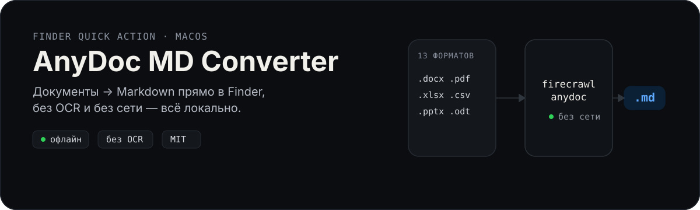
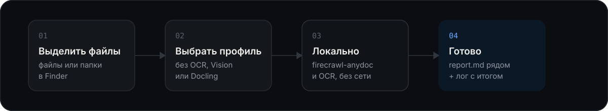

<p align="center">
  
</p>

Правый клик по файлам или папкам в Finder → «Конвертировать в Markdown». Движок —
[Firecrawl AnyDoc](https://github.com/firecrawl/anydoc) (чистый Rust, Python-пакет `firecrawl-anydoc`):
всё считается локально, файлы никуда не отправляются. Три профиля на выбор: без OCR (только
текстовые документы), OCR через Vision (быстро) и OCR через Docling (заголовки и таблицы) — оба
бэкенда тоже работают полностью локально.

<p align="center">
  
</p>

## Форматы

| Тип | Расширения |
|---|---|
| Word | `.doc` `.docx` `.docm` |
| PowerPoint | `.ppt` `.pps` `.pot` `.pptx` `.pptm` `.ppsx` `.ppsm` |
| Excel | `.xls` `.xlsx` `.xlsm` `.xlsb` |
| OpenDocument | `.odt` `.ods` `.odp` |
| Прочее | `.rtf` `.epub` `.csv` `.pdf` |
| Картинки (только в OCR-режимах) | `.png` `.jpg` `.jpeg` `.tif` `.tiff` `.bmp` `.webp` `.heic` |

## Установка

Требования: macOS 11+, Apple Silicon или Intel, сеть для первой установки. `sudo` не нужен.

1. Скачай папку проекта (или `git clone`).
2. Дважды кликни **`Установить.command`** (или в терминале `zsh macos/install.sh`).
   Если macOS не даёт запустить: правый клик → «Открыть».
3. Выбери профиль: `1` без OCR, `2` Vision (рекомендуется), `3` Docling. Без ответа берётся
   ранее установленный профиль или Vision. Неинтерактивно: `ANYDOC_MD_PROFILE=docling zsh macos/install.sh`.
4. Готово. Повторный запуск установщика обновляет всё (движок, скрипты, Quick Actions), профиль
   можно сменить в любой момент.

Что делает установщик:

- кладёт движок в изолированное окружение `~/Library/Application Support/AnyDoc MD Converter/`
  (Python ≥3.10 приносит через [uv](https://docs.astral.sh/uv/), если в системе подходящего нет;
  сам uv тоже кладётся внутрь этой папки, ничего глобального не ставится);
- создаёт Quick Actions в `~/Library/Services/` (один на каждый установленный бэкенд);
- для профиля Docling скачивает модели разметки в ту же папку приложения (`models/`), чтобы первый
  запуск из Finder не висел на докачке;
- делает симлинк `~/.local/bin/anydoc-md` для терминала;
- прогоняет пробную конвертацию.

Папка `Application Support` выбрана не случайно: службам Finder напрямую недоступны «Документы»,
а вот из `~/Library` скрипт спокойно читает и пишет в любые папки пользователя.

## После установки: включить пункты в меню Finder

macOS не всегда показывает новые Быстрые действия сразу. Если после установки в контекстном меню
Finder нет пункта «Конвертировать в Markdown…», включи его руками. Это делается один раз.

1. В Finder щёлкни **правой кнопкой** (или Control + клик) по любому файлу или папке.
2. В появившемся меню наведи на пункт **«Быстрые действия»**. Откроется подменю.
3. В самом низу подменю нажми **«Настроить…»**. Откроются Системные настройки на разделе расширений.
   Если в подменю есть только «Ещё…», нажми его и затем «Настроить…».
4. В открывшемся окне найди список Быстрых действий для Finder:
   - macOS 15 Sequoia и новее: **Основные → Объекты входа и расширения → раздел «Расширения» → Finder →
     кнопка ⓘ** справа.
   - macOS 13 Ventura и 14 Sonoma: **Основные → Расширения → Finder** (или строка «Быстрые действия»).
5. Поставь галочки напротив пунктов:
   - «Конвертировать в Markdown (без OCR)» — есть всегда;
   - «Конвертировать в Markdown (OCR: Vision)» — если ставил профиль Vision или Docling;
   - «Конвертировать в Markdown (OCR: Docling)» — если ставил профиль Docling.
6. Нажми «Готово» и закрой настройки. Снова щёлкни правой кнопкой по файлу: пункты появились.

Если пунктов нет даже в списке настроек, обнови реестр служб и перезапусти Finder, затем повтори с шага 1:

```bash
/System/Library/CoreServices/pbs -update
killall Finder
```

Те же пункты доступны и без контекстного меню: выдели файлы в Finder, открой боковую панель
просмотра (⇧⌘P), внизу будет кнопка «Ещё…» с этими же действиями.

При первом запуске macOS может спросить разрешение на доступ к «Документам», «Рабочему столу» или
«Загрузкам». Нажми «Разрешить», иначе конвертер не сможет прочитать файлы и записать результат.

## Использование

**Finder.** Выдели файлы и/или папки → правый клик → Быстрые действия → «Конвертировать в Markdown
(без OCR)», «… (OCR: Vision)» или «… (OCR: Docling)». Папки обходятся рекурсивно. Во время работы в строке меню крутится шестерёнка, по
завершении — уведомление с итогом. Если были ошибки или файлы, требующие OCR, — диалог с кнопкой
«Открыть лог».

**Терминал.**

```bash
anydoc-md ~/Documents/Договоры            # папка рекурсивно
anydoc-md report.docx slides.pptx         # отдельные файлы
anydoc-md -n ~/Documents/Договоры         # dry-run: показать план, ничего не писать
anydoc-md --mode mirror ~/Documents/Архив # результат в ~/Documents/Архив_md/
anydoc-md -j 1 ~/Downloads/big            # строго по одному файлу
anydoc-md --overwrite always ПАПКА        # переконвертировать всё своё заново
anydoc-md --ocr vision ~/Scans            # сканы и картинки через Vision
anydoc-md --ocr docling ~/Scans           # то же, но с заголовками и таблицами
anydoc-md --update                        # обновить движок firecrawl-anydoc
anydoc-md --version
```

### Куда кладётся результат

По умолчанию `.md` создаётся **рядом с исходником**: `report.docx → report.md`. Если в одной
папке лежат `report.docx` и `report.pdf`, оба получают полное имя: `report.docx.md`, `report.pdf.md`.
Режим `mirror` создаёт соседнюю папку `Имя_md` с той же структурой и не трогает исходную.

### Повторные запуски и защита своих заметок

В начало каждого сгенерированного файла пишется невидимая для Markdown-рендеров метка
`<!-- anydoc-md: converted from "report.docx" -->`. Благодаря ей:

- повторный запуск на той же папке перезаписывает только те `.md`, чей исходник стал новее
  (инкрементальная работа с большими архивами);
- `.md` без метки (написанный руками) **никогда не перезаписывается**, если не включить
  `overwrite_foreign` в конфиге.

### OCR: что даёт каждый бэкенд

| | Vision | Docling + Vision |
|---|---|---|
| Распознавание букв | Vision framework (тот же, что Live Text) | тот же Vision |
| Абзацы, переносы слов | да | да |
| Заголовки | нет | да (`##`) |
| Таблицы | простые: строки с несколькими фрагментами на одной высоте собираются в таблицу | да, TableFormer восстанавливает ячейки |
| Смешанные PDF (текст + сканы) | текстовые страницы через PDFKit, сканы через OCR, с пометкой страниц | весь документ через Docling |
| Скорость на M-серии | 0,5–1 с на страницу | ~10 с прогрев моделей, затем 1–2 с на страницу |
| Память | ~300 МБ на процесс | 1,5–2 ГБ на процесс |
| Языки | `ocr_languages`, по умолчанию ru-RU + en-US, macOS 13+ для русского | те же |

Первая строка `.md` после OCR: `<!-- anydoc-md: converted from "scan.pdf" (ocr: vision) -->`.
Если после Vision качество не устраивает, ту же папку можно прогнать через Docling: файлы с меткой
перезаписываются по обычным правилам (`overwrite: always` в конфиге или флаг `--overwrite always`).

### Нагрузка и параллелизм

Цель — работать на любом Mac, не съедая память и не мешая другой работе:

- число рабочих процессов выбирается автоматически:
  `min(4, физ.ядер / 2, RAM_ГБ / 4)`, минимум 1; если система уже нагружена (load average
  выше 75 % ядер) — ещё вдвое меньше. На 8 ГБ Mac это 2 процесса, на 16 ГБ — до 4;
- большие файлы (PDF ≥ 40 МБ; docx/xlsx/pptx/odt/epub ≥ 6 МБ, потому что они сжаты в ~10 раз)
  конвертируются строго по одному, остальные — параллельно; большие ставятся в конец очереди;
- перед выдачей каждой задачи проверяется `kern.memorystatus_level`; если свободной памяти
  меньше 12 % — пауза до её освобождения;
- рабочие процессы перезапускаются каждые 64 файла (память гарантированно освобождается),
  всё выполняется с `nice 10`;
- OCR идёт в отдельном пуле: Vision до 2 процессов, Docling строго 1 (одна копия моделей в памяти),
  Docling-процесс не перезапускается между файлами, чтобы не грузить модели заново;
- у самого движка есть жёсткие лимиты (например, 2 млн XML-узлов на часть документа) — очень
  большие таблицы он отклоняет, а не раздувает память; такие файлы попадают в лог с советом
  разбить документ.

Ориентир на M-серии: ~400 docx по 23 КБ — 4 секунды при 4 процессах.

### Обновления

Раз в 7 дней после очередной конвертации в фоне запускается `--update` (`uv pip install -U
firecrawl-anydoc`). Обновление берёт файловый lock и ждёт, пока не закончатся текущие конвертации.
Отключить: `"auto_update": false` в конфиге. Скрипты самого конвертера обновляются перезапуском
`Установить.command`.

## Настройки

`~/Library/Application Support/AnyDoc MD Converter/config.json` (создаётся при установке; полный
пример — `config.example.json`):

| Ключ | По умолчанию | Смысл |
|---|---|---|
| `output_mode` | `beside` | `beside` — рядом с исходником, `mirror` — папка `*_md` |
| `overwrite` | `if_newer` | `never` / `if_newer` / `always` (свои файлы) |
| `overwrite_foreign` | `false` | разрешить перезапись `.md` без метки |
| `max_workers` | `auto` | число процессов или `auto` |
| `max_workers_cap` | `4` | верхняя граница для `auto` |
| `big_file_mb` | `40` | порог «большого» файла (по одному) |
| `big_zip_file_mb` | `6` | тот же порог для docx/xlsx/pptx/odt/epub |
| `memory_floor_percent` | `12` | ниже — притормаживаем выдачу задач |
| `max_file_mb` | `500` | больше — пропуск с записью в лог (0 = без лимита) |
| `extensions` | все поддерживаемые | что искать в папках |
| `skip_dir_names` | `.git`, `node_modules`, … | куда не заходить |
| `source_marker` | `true` | писать метку-комментарий в начало `.md` |
| `notifications` / `error_dialog` | `true` | уведомления и диалог об ошибках |
| `ocr_backend` | `none` | `none` / `vision` / `docling` для CLI без флага `--ocr` |
| `ocr_workers` | `auto` | процессов OCR: auto = 2 для Vision, 1 для Docling |
| `ocr_languages` | `["ru-RU","en-US"]` | языки распознавания |
| `ocr_dpi` | `200` | разрешение рендера страниц PDF для Vision |
| `image_extensions` | png, jpg, … | картинки, которые берём в OCR-режимах |
| `auto_update` / `update_interval_days` | `true` / `7` | автообновление движка |

Логи: `~/Library/Logs/anydoc-md/latest.log` (хранится 50 последних запусков).

## Удаление

`Удалить.command` или `zsh macos/uninstall.sh [--keep-config] [--keep-logs]`. Удаляет папку в
Application Support, все Quick Actions, симлинк и логи. Сконвертированные `.md` остаются.

## Структура проекта

```
Установить.command / Удалить.command   — кликабельные обёртки для Finder
macos/install.sh, uninstall.sh          — установщик/деинсталлятор
macos/quick-action.py                   — генератор .workflow (системный python3, без зависимостей)
bin/anydoc-md                           — лаунчер (venv + nice + PYTHONPATH)
src/anydoc_md/                          — конвертер
  config.py   — настройки и значения по умолчанию
  scan.py     — обход папок, план задач, имена выходных файлов
  convert.py  — конвертация одного файла (в рабочем процессе), метка, политика перезаписи
  system.py   — ядра/память/load average для auto-параллелизма
  runner.py   — быстрый пул (anydoc) и OCR-пул, ограничения по памяти, лог, уведомления
  updater.py  — обновление движка с блокировкой
  ocr/        — OCR-бэкенды: vision.py (Vision + Quartz/PDFKit), docling_backend.py
tests/test_scan.py                      — юнит-тесты (pytest, движок не нужен)
tests/smoke.sh                          — интеграционный прогон на установленном движке
config.example.json                     — все ключи config.json со значениями по умолчанию
assets/readme/                          — картинки для этого README
```

Тесты: `python3 -m pytest tests` (нужен Python ≥3.10) и `zsh tests/smoke.sh` после установки.

## Ограничения

- В профиле `base` сканы и PDF из картинок пропускаются (`NeedsOcrError`, в логе указаны страницы).
- Картинки внутри docx/pptx заменяются alt-текстом; сканы, вложенные в офисные документы и в PDF
  с текстовым слоем, не распознаются.
- Vision распознаёт русский начиная с macOS 13; на macOS 11–12 OCR будет только для латиницы.
- Docling требует ~2 ГБ на диске и до 2 ГБ памяти во время работы.
- Зашифрованные/защищённые паролем файлы пропускаются.
- Не Finder-специфичные ограничения движка: `.doc`/`.xls`/`.ppt` старых бинарных форматов
  поддерживаются, но экзотические варианты могут дать `MalformedError`.

Лицензии: AnyDoc — MIT (Firecrawl), Docling — MIT (IBM), PyObjC — MIT. Этот проект — обвязка для
macOS поверх них.
